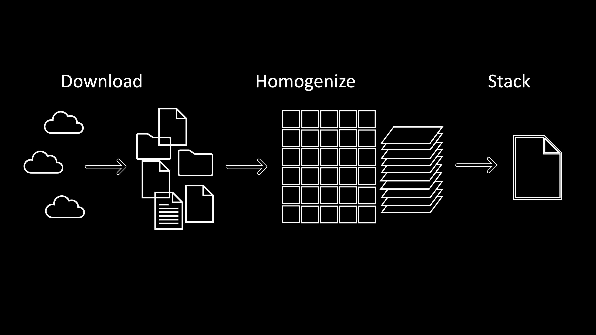

# Work in Progress

# CHANGED
 Chlorophyll-a Homogenization and ANalysis for GrEenlanD

CHANGED interpolates chlorophyll-a estimates from AquaMODIS and SeaWiFS to a standardized grid. 

To use CHANGED:
1. Clone the repository. 
2. Install with `pip install .`
3. Run Download_Data.ipynb to download AquaMODIS and SeaWiFS data
4. WIP
